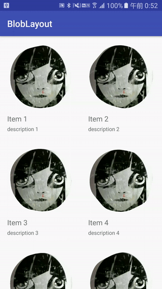
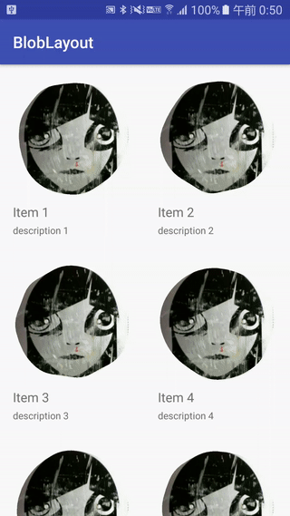

# BlobLayout
BlobLayout is custom layout like blob style.
This layout can be transformed from CIRCLE style to RECT style with animation.

Transform | Shared Element Transition
---- | ----
 | 

## Getting Started
```groovy
dependencies {
  compile 'com.github.r21nomi:bloblayout:0.1.2'
}
```

## Usage
Used in XML.
```xml
<com.r21nomi.blobtransition.BlobLayout
    android:layout_width="wrap_content"
    android:layout_height="wrap_content"
    app:noise="0.1">

    <ImageView
        android:layout_width="48dp"
        android:layout_height="48dp"
        android:src="@drawable/img" />
</com.r21nomi.blobtransition.BlobLayout>
```

Transform from CIRCLE to RECT.
```java
blobLayout.animateToRect();

```

Shared element transition.
```java
public static Intent createIntent(Context context, BlobLayout sharedElement) {
    Intent intent = new Intent(context, DetailActivity.class);
    intent.putExtra(POSITION, new Position(sharedElement));

    return intent;
}

@Override
protected void onCreate(Bundle savedInstanceState) {
    ...

    position = getIntent().getParcelableExtra(POSITION);
    blobLayout = (BlobLayout) findViewById(R.id.maskLayout);

    ViewGroup.LayoutParams param = view.getLayoutParams();
    param.width = position.getWidth();
    param.height = position.getHeight();
    view.setLayoutParams(param);

    blobLayout.getViewTreeObserver().addOnPreDrawListener(new ViewTreeObserver.OnPreDrawListener() {
        @Override
        public boolean onPreDraw() {
            blobLayout.getViewTreeObserver().removeOnPreDrawListener(this);

            startEnterAnimation();
            return true;
        }
    });
}

private void startEnterAnimation() {
    int targetWidth = getTargetWidth();
    int targetHeight = targetWidth * position.getWidth() / position.getHeight();

    float top = position.getTop() - getStatusBarHeight();
    // Use setX / setY to set absolute position.
    blobLayout.setX(position.getLeft());
    blobLayout.setY(top);

    AnimatorSet animSet = new AnimatorSet();
    animSet.playTogether(
            blobLayout.getToRectAnimator(),
            // Use translationX / translationY to translate to relative position.
            ObjectAnimator.ofFloat(blobLayout, "translationX", 0),
            ObjectAnimator.ofFloat(blobLayout, "translationY", 0),
            ValueAnimator.ofObject(new WidthEvaluator(blobLayout), position.getWidth(), targetWidth),
            ValueAnimator.ofObject(new HeightEvaluator(blobLayout), position.getHeight(), targetHeight)
    );
    animSet.setDuration(500);
    animSet.setInterpolator(new AccelerateDecelerateInterpolator());
    animSet.start();
}

```
See [sample](app/src/main/java/com/r21nomi/sample/activity/DetailActivity.java).

## License
```
Copyright 2017 Ryota Niinomi (r21nomi)

Licensed under the Apache License, Version 2.0 (the "License");
you may not use this file except in compliance with the License.
You may obtain a copy of the License at

http://www.apache.org/licenses/LICENSE-2.0

Unless required by applicable law or agreed to in writing, software
distributed under the License is distributed on an "AS IS" BASIS,
WITHOUT WARRANTIES OR CONDITIONS OF ANY KIND, either express or implied.
See the License for the specific language governing permissions and
limitations under the License.
```